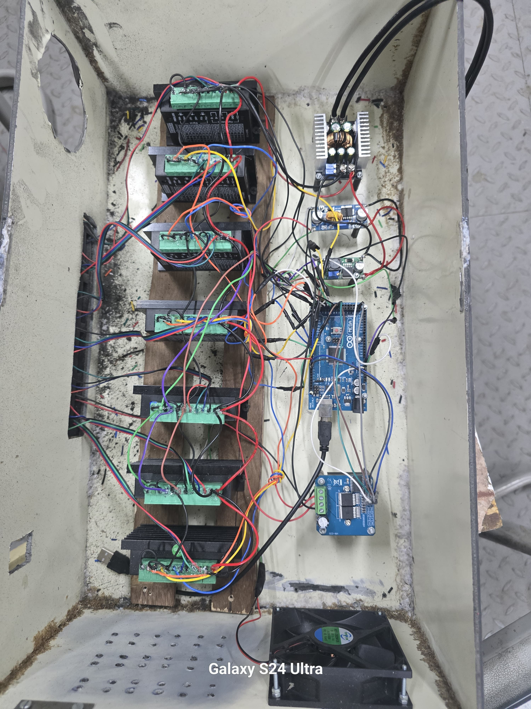

# SAEINDIA TIFAN Project

## Automated Multi-Vegetable Transplanter

This project was developed for the SAEINDIA TIFAN competition and focuses on automating the transplantation of vegetable seedlings using an electrically powered pick-and-place mechanism.

## My Role

Electronics Team Lead 

### Responsibilities

* Electrical system design
* Arduino Mega programming
* Stepper motor control
* TB6600 driver integration
* Battery system planning
* Solar charging integration
* Automation sequence development
* System testing and troubleshooting

## System Components

### Control System

* Arduino Mega

### Actuators

* 7 NEMA 17 Stepper Motors
* 1 DC Geared Motor

### Motor Drivers

* TB6600 Stepper Drivers
* Bts7960 dc motor driver

### Sensors

* Limit Switch Sensors

### Power System

* 36V 30Ah Lithium-ion Battery
* MPPT Charge Controller
* 335W Solar Panel

## Features

* Automated seedling pick-and-place mechanism
* Multi-axis motion control
* Battery-powered operation
* Solar-assisted charging system
* Agricultural automation

## Technologies Used

* Arduino
* Embedded C/C++
* Stepper Motor Control
* Robotics
* Automation
* Power Electronics
* Solar Energy Systems
* Agricultural Engineering

## Repository Structure

Arduino_Code → Control software

Images → Project photographs and documentation

## Project Gallery

### Complete Machine

### Electronics Control System

### Arduino Control System

### TB6600 Driver System

### Custom PCB

### Solar Integration

### Competition Demonstration

### SAEINDIA TIFAN Team

